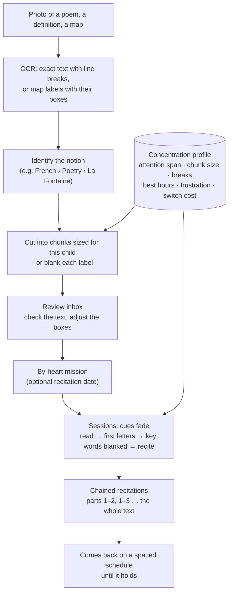
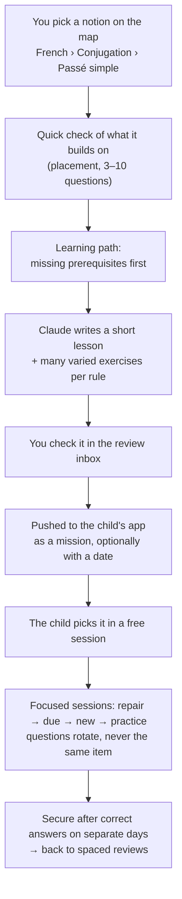
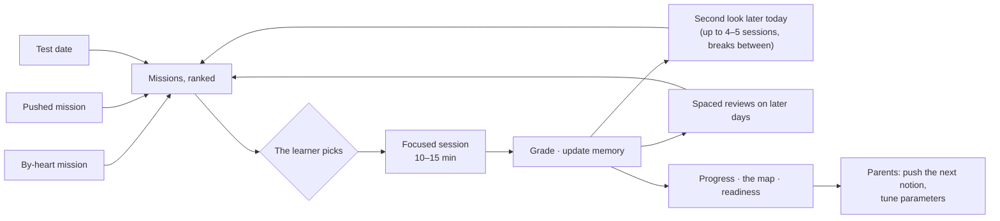
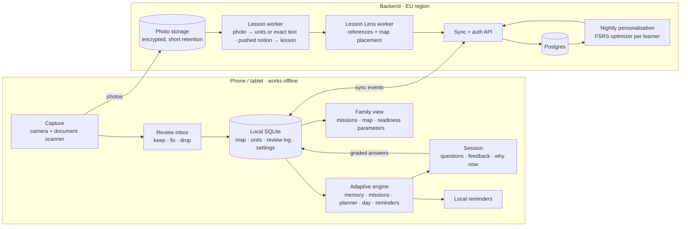
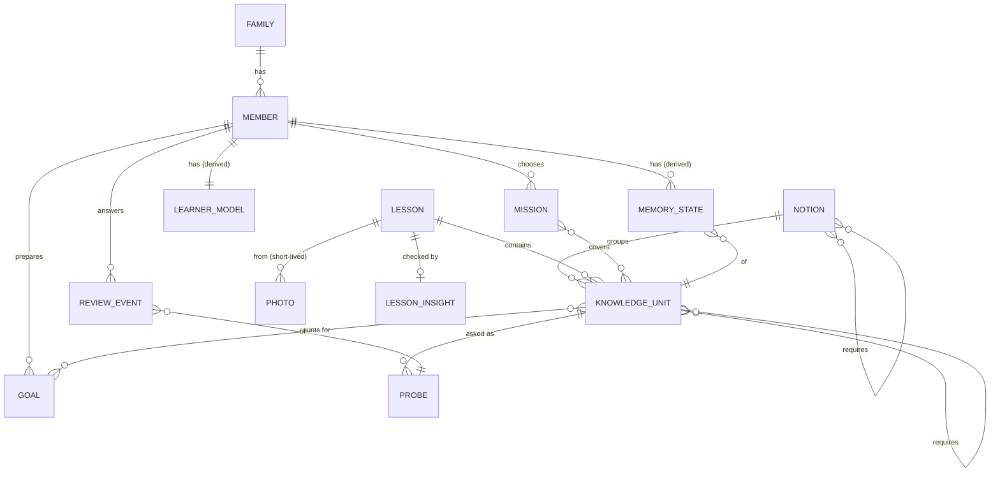

# Architecture proposal

Status: **v0.2, open for discussion** (2 October 2026).
Companion documents: [Adaptive engine](ADAPTIVE_ENGINE.md) · [Parameters](PARAMETERS.md) · [Calm-by-design charter](CHARTER.md) · [clickable prototype](../prototype/index.html)

---

## 1. What we are building

A learning companion for the family, on phone and tablet, built around **two use cases on one engine**:

1. **Learn a lesson by heart.** A photographed poem, definition or map is read by OCR, cut into chunks sized for the child, and learned with cues that fade (or labels that are blanked), then brought back on a spaced schedule until it can be recited. The notion is identified and a learning path is activated, paced by the child's **concentration profile**: attention span, chunk size, breaks, best hours. An **audio mode** (listen, repeat, recite aloud) comes in phase 2.
2. **Parents push a notion.** You pick a notion on the knowledge map, for example *French › Conjugation › Passé simple*, and push it to a child's app. A quick check finds what it builds on, Claude writes a short lesson with many varied exercises, and the child practises it in free sessions. This is about understanding and skill, not word-for-word learning.

Both use cases become **missions** the learner picks, worked through in short focused sessions (10–15 minutes, up to 4–5 a day with breaks), each scheduled around that person's memory. Knowledge is measured on an **absolute map of notions**, not by school grade.

It is built as the opposite of an engagement product. **Success means knowledge kept per minute spent**, and the app's reminders are designed to make themselves unnecessary.

| Need | Subsystem | Section |
|---|---|---|
| Learn a lesson by heart: chunks, fading cues, blanked maps, recitation | Learning by heart + concentration profile | [2.1](#21-use-case-1-learn-a-lesson-by-heart) |
| Push a notion for free practice | Knowledge map, placement check, generated lessons, pushed missions | [2.2](#22-use-case-2-parents-push-a-notion) |
| Choose what to work on, and focus on it | Missions | [5.2](#52-missions-and-sessions) |
| Review schedules adapted to each person | Adaptive engine | [6](#6-the-adaptive-engine-in-one-page) |
| Learning curve of every notion ("everything is a language") | Memory model per unit, status per notion | [5.3](#53-the-knowledge-map-absolute-level-not-school-grade) |
| Compare lessons with reference textbooks and papers | Lesson Lens | [5.4](#54-lesson-lens-comparing-with-reference-material) |
| Tune everything | Parameters | [7](#7-parameters) |

### 1.1 Who it is for

The **children are 10 to 13**. **You and your wife** are both the builders and parent learners. Ages set time limits and answer modes, never the content: what a child learns follows the knowledge map. A family can choose anything inside a band's limits, never outside them (`packages/engine/src/profiles.ts`).

| | Children 10–11 | Children 12–13 | Parents |
|---|---|---|---|
| One session: default (range) | 10 min (5–15) | 12 min (5–15) | 15 min (5–30) |
| Sessions per day: default (range) | 2 (1–5) | 2 (1–5) | 2 (1–5) |
| Break between sessions, at least | 90 min | 90 min | 60 min |
| New units per day, at most | 10 | 14 | 20 |
| Reminders per day, at most | 1 | 1 | 2 |
| Answer modes | choices, voice, short typing | + maths entry, a sentence or two for "explain" | everything |
| Who sees progress | parents and child, same view | parents and child, same view | only the parent, unless shared |
| Consent | parents | parents | their own |

The child limits are enforced in code and tested. Within them, the **concentration profile** adjusts each session to the child (§2.1). Every other knob is a [parameter](PARAMETERS.md).

## 2. The two use cases

### 2.1 Use case 1: learn a lesson by heart



* **OCR and notion.** The extraction (`mode: by_heart`) copies the text exactly, keeping line breaks and punctuation, and names the notion. For a map or diagram, it lists each label with an approximate box, which you can adjust in the review inbox.
* **Chunks sized for this child** (`chunkText`). Cuts fall at line ends, so a verse is never split. The chunk size comes from the concentration profile: 8 words by default at 10–11, 12 at 12–13, then learned from how much of a first study sticks.
* **Fading cues** (`cueFor`). The first meeting shows the full text. Then first letters. From a memory stability of 2 days, key words are blanked. From 5 days, the chunk is recited with nothing shown. With the real engine on the first verses of *Le Corbeau et le Renard*:

  ```
  read             | Maître Corbeau, sur un arbre perché, / Tenait en son bec un fromage.
  first-letters    | M_____ C______, s__ u_ a____ p_____, / T_____ e_ s__ b__ u_ f______.
  key-words-blank  | ______ _______, sur un _____ ______, / ______ en son bec un _______.
  recite           | … / …
  ```
* **Chaining** (`byHeartUnits`). Nine verses at 12 words become parts 1–4, then chained recitations "parts 1–2", "parts 1–3" and "whole text". Each chain unlocks once its parts hold, so the child never faces the whole poem before knowing its pieces.
* **Blanked maps** (`figureUnits`). Each label is a unit: the label is hidden and the child names it. The last unit hides every label at once, i.e. "blank the map".
* **Grading a recitation** (`compareRecitation`). Words are compared in order (longest common subsequence). 95% is correct; 85% is a near miss that comes back soon; below that, the chunk is relearned. The missing words are shown as feedback. Accents count only when spelling is the point.
* **Concentration profile** (`concentration.ts`). Learned from the child's own sessions, starting from age defaults and moving toward the child's data as sessions accumulate. It sets:

  | What it measures | How it is learned | What it changes |
  |---|---|---|
  | Attention span | the minute, pooled over sessions, where accuracy drops or answer time rises | session length (never above the family limit) |
  | Chunk size | the largest chunk whose first study usually holds | how the text is cut |
  | Recovery | the shortest break after which the next session starts well | the break between sessions |
  | Best hours | the hours with the best results | suggested times and reminder slots |
  | Frustration point | the run of misses after which the next answer is usually missed too | when to ease off and when to stop |
  | Switch cost | accuracy lost right after changing subject | whether mixed reviews are interleaved or grouped |

* **Audio mode (phase 2).**
  * **Listen:** each chunk is read aloud (device text-to-speech, or a parent's recording) before it is shown.
  * **Recite aloud:** on-device speech recognition turns the recitation into text, graded by the same word-by-word comparison.
  * **Hands free:** a listen-and-repeat cycle works with the screen off, for example in the car.

### 2.2 Use case 2: parents push a notion



* **Pick the notion.** Notions are organised as domain › area › notion. You can browse the map or type a name; Claude matches a typed name to an existing notion or proposes a new one with its prerequisites. Sample maps: [`maps/maths-core.json`](../packages/engine/maps/maths-core.json), [`maps/french-core.json`](../packages/engine/maps/french-core.json).
* **Check what it builds on.** `PlacementCheck` asks about prerequisites in the order that settles the most at once. `learningPath()` keeps only what is missing, foundations first.
* **Write the lesson.** `teachNotion()` writes it for the child's age, building on what is known. It includes at least eight varied exercises per rule or method, for example different verbs and persons for a conjugation (*chanter → ils chantèrent; finir → nous finîmes; être → il fut*). `pickProbe()` rotates through them, least recently asked first, so the child practises the rule rather than memorising one answer.
* **Push it.** It appears on the child's mission list as "pushed by your parents", ranked high but never forced. In a free session, the child chooses it.

Worked example, the output of `npm run push` on the maths map with a synthetic child's answers:

```
Parents push: "Solving linear equations" (Léa, 13)

1. Placement check
   asks about "What a fraction means" → passed
   asks about "Negative numbers: operations" → missed
   asks about "Order of operations" → passed
   asks about "Equivalent fractions" → passed
   asks about "Adding and subtracting fractions" → missed
   5 questions settled 10 notions: 4 missing

2. Learning path (becomes the mission)
   1. Negative numbers: operations
   2. Algebraic expressions
   3. Adding and subtracting fractions
   4. Solving linear equations

3. Mission "Before high school: Solving linear equations": 12 units
   09:00 session: 6 cards, ~3 min (6 new)
      next useful session: 10:30
   10:45 session: 9 cards, ~3 min (6 review, 3 new)
      next useful session: 12:15
   17:30 session: 12 cards, ~4 min (4 review, 3 new, 5 practice)
      next useful session: 19:00

4. End of day: 12 of 12 units started, 0 secure (secure needs correct answers on separate days)
```

The pushed notion pulled in the two prerequisites that were actually missing and skipped the six that were known. Over the next days, spaced reviews make the units secure.

### 2.3 What both use cases share



| Step | Who | What happens | Code |
|---|---|---|---|
| Missions are suggested | engine | A close test or recitation date comes first, then notions pushed by parents and by-heart texts, then topics. "Keep everything fresh" rises as reviews pile up. | `missions.ts` |
| The learner picks | child | Any mission, not only the first. Autonomy is part of the design. | app |
| A session runs | engine | Focused on the mission. Weak foundations first, then due reviews, new units in prerequisite order, and extra practice. Sized by the concentration profile, it ends on a likely success. | `planner.ts`, `session.ts`, `concentration.ts` |
| The day continues | engine | Up to the family's limit, with breaks. Anything new or missed comes back for a second look in a later session. If nothing is useful yet, the app says when it will be, never offers filler. | `day.ts` |
| Progress shows | everyone | A unit is *secure* once its memory holds for a week. A mission is complete when all its units are secure. | `missions.ts`, `knowledge-map.ts` |
| Parents steer | parents | Push the next notion, see the map, adjust [parameters](PARAMETERS.md). | app |

A photographed lesson to *understand* (rather than to learn by heart) uses the same path as use case 2: its notions are identified and become units on the map ([§5.1](#51-capture--cards)).

## 3. Principles

1. **Learning science over engagement metrics.** The app uses retrieval practice, spacing, interleaving, immediate feedback, desirable difficulty and mastery learning, which have the strongest evidence of the techniques studied ([Dunlosky et al., 2013](#references); [Kulik et al., 1990](#references)).
2. **The learner chooses the focus.** Missions (a text to learn by heart, a notion pushed by parents, a test, a topic) are suggested and ranked, never imposed. A mission session goes entirely to the mission.
3. **Finite by design.** Each session fits its length and ends. A session is offered only when it is useful, up to the number the family allows per day.
4. **Absolute knowledge, not school grade.** One map of notions and prerequisites (domain › area › notion). Any curriculum, a notion pushed by parents or a photographed lesson points at the same map.
5. **Adapted to each person.** Each learner has their own memory model and concentration profile. Targets follow tests, and reminders follow each child's habits. Every knob is a documented [parameter](PARAMETERS.md).
6. **Autonomy, competence and relatedness** ([Self-Determination Theory](#references)) replace streaks, gems and leagues.
7. **Explainable.** Every card can say why it is shown now. Parents and children see the same information about the child.
8. **Local-first and private.** Scheduling runs on the device and works offline. Children's data is minimal and hosted in the EU.
9. **The teacher's version comes first.** Reference material adds to a lesson; it never overwrites what the child will be tested on.

The full rule set, including which rules are enforced by tests, is in the [charter](CHARTER.md).

## 4. System overview



| Runs on the device | Runs on the server |
|---|---|
| Scheduling, missions, session planning, grading of short answers, reminders: these must work offline, respond instantly and keep answer data local. | Claude calls (the API key never ships in the app), the FSRS optimizer, sync and backups. |

The engine is one TypeScript package ([`packages/engine`](../packages/engine)) that runs unchanged on the phone and on the server.

## 5. Main flows

### 5.1 Capture → cards

```mermaid
sequenceDiagram
  actor Child
  participant App
  participant Server
  participant Claude as Claude API
  Child->>App: Photograph 1–4 pages
  App->>App: Document scanner: crop, deskew, enhance
  App->>Server: Upload (encrypted)
  Server->>Claude: Photos + age → structured lesson
  Claude-->>Server: Units (each named by its notion), questions, misconceptions, unclear spots
  Server->>Claude: Lesson Lens (references + map)
  Claude-->>Server: Placement on the map, gaps, possible errors, with citations
  Server-->>App: Draft lesson
  Child->>App: Review inbox: keep, fix or drop each card (1–2 min)
  App->>App: Units join the map; new ones are introduced a few per day
```

* **Scanner on the device:** ML Kit Document Scanner on Android, VisionKit on iOS. Better photos mean better extraction, and the scanner adds no upload cost.
* **Beyond photos:** worksheets sometimes arrive as PDFs on a school platform. Claude reads PDFs directly, so the same extraction accepts a file instead of a photo. Parents learning their own topics can add PDFs, slides or papers, or import an existing Anki deck.
* **Extraction:** one Claude call with vision and structured output. The schema and prompt are in [`packages/ingest`](../packages/ingest), and an example output is in [`fixtures/fractions.json`](../packages/ingest/fixtures/fractions.json). The call:
  * splits the lesson into units, one idea each;
  * names each unit's notion generically, so it lands on the absolute map;
  * keeps the teacher's wording;
  * writes questions at several levels, with fresh numbers for maths methods;
  * lists common misconceptions, which become wrong answer choices and extra checks;
  * marks anything it couldn't read as `uncertain` instead of guessing.
* **To learn by heart:** with `mode: by_heart`, the extraction copies the exact text (or the map labels with their boxes) and the engine builds the chunks ([§2.1](#21-use-case-1-learn-a-lesson-by-heart)).
* **A pushed notion without a photo:** `teachNotion()` writes the lesson. It gets the notion, the child's age, what the placement check found known, and why you pushed it. The output has the same shape, so it goes through the same review inbox.
* **Rough cost:** a photographed page is about 2k input tokens plus a few thousand output and thinking tokens, so roughly 10–20 US cents per page with `claude-opus-5-5`. For two children photographing about one page a day each, that is roughly $10–20 a month. Lessons that can wait an hour can go through the Batch API at half price. Switching to a cheaper model is your decision, best taken after measuring quality on your own photos.

### 5.2 Missions and sessions

**A mission is what the learner chooses to work on** (`packages/engine/src/missions.ts`):

| Mission | Covers | Typical origin |
|---|---|---|
| **By heart** | The chunks and chained recitations of a text, or the labels of a map | A photographed lesson to learn by heart (use case 1) |
| **Pushed** | The notions on a learning path: the pushed notion plus its missing prerequisites | Parents push a notion (use case 2) |
| **Test** | Every unit a dated test covers | A test date entered by the child or a parent |
| **Topic** | Anything chosen freely: a subject, a lesson, a notion | The child ("I want to get Spanish verbs right") |
| **Keep everything fresh** | Whatever is due, across subjects, interleaved | Always available; suggested more strongly as reviews pile up |

The app ranks missions. A close test or recitation date comes first, then pushed notions and by-heart texts, then topics; each shows a reason ("in 4 days · 74% ready", "pushed by your parents · 2 of 12 secure"). The learner picks any of them.

**A mission session goes entirely to the mission.** This is the "focus the maximum possible" principle. The planner fills it in this order:

1. **Repair:** prerequisites of the mission whose recall has dropped below 80% come first. Foundations are fixed before building on them.
2. **Due reviews** of mission units, most at risk first.
3. **New units** in prerequisite order. Within one notion, a unit can follow its prerequisite in the same session, so a notion is learned in one go. A different notion waits until its prerequisites are known.
4. **Extra practice** on mission units that are not secure yet, lowest recall first, until the session is full.

The session is ordered foundations first, one notion at a time, ending on a likely success. Due reviews from other subjects **wait**: the plan reports how many, and nothing is lost by a day's wait. If a mission is small, the session is short: it never pads with other material. That is the default; the `mission.focusShare` parameter can reserve part of a session for at-risk reviews from other subjects.

**Blocked inside a mission, interleaved in mixed review.** Practising one notion at a time suits a skill being acquired. Mixing subjects and problem types is better for telling similar things apart and for long-term retention ([Rohrer & Taylor, 2007](#references); [Brunmair & Richter, 2019](#references)). Missions use the first; "keep everything fresh" uses the second.

**When a mission is complete:** a unit is *secure* once its memory stability reaches 7 days. That takes correct answers on separate days, which is successive relearning ([Rawson & Dunlosky, 2011](#references)), not one good session. When every unit is secure, the mission is complete and its units return to normal spaced reviews.

**Several sessions a day** (`packages/engine/src/day.ts`):
* **Limits:** up to the family's number of sessions (default 2, at most 5), each 10–15 minutes, at least 90 minutes apart.
* **Second looks:** a unit that is new or missed in one session comes back in a later session the same day. The memory model's same-day steps are set to the break length, and FSRS-6 models these short-term reviews.
* **New material across the day:** the daily new-unit limit is shared across sessions.
* **No filler:** when nothing is useful yet, the app shows when the next session will be ("18:30: second looks at this morning's units") instead of offering one.
* **Reminders:** still at most one a day for a child. Later sessions start on the child's initiative.

**Inside every session:**
* **Grading is objective:** correctness, hints used, and answer time compared with the child's own usual speed. Children are never asked to rate themselves.
* **Answer modes:** typing; multiple choice while a memory is still fragile; speaking (on-device speech recognition); and maths entry checked for equivalence (1/2 = 0.5 = 2/4 when the question allows it). From 12, "explain" questions accept a sentence or two, graded by Claude against the model answer written at extraction.
* **A run of misses:** after three in a row, an easier unit comes next. After five, the session ends kindly.
* **Retries and stopping:** missed units come back once at the end. The child can stop at any time with no penalty.

### 5.3 The knowledge map: absolute level, not school grade

**Notions and prerequisites, independent of any school system** (`packages/engine/src/knowledge-map.ts`, sample map: [`maps/maths-core.json`](../packages/engine/maps/maths-core.json)):
* A **notion** is one idea or skill, such as "adding fractions with different denominators". It sits in a domain › area hierarchy (*French › Conjugation › Passé simple*) and lists the notions it builds on.
* A **level** is a position on this map, not a grade. Where a domain has a real absolute scale, the notion carries it, for example CEFR A1–C2 for languages.
* **Sources point at the same map:** any curriculum (French, British, IB, US Common Core) becomes a *checklist* of notions, for example "usually expected before high school". So does a notion you push, and so does each photographed lesson.

**Units sit under notions.** Every subject is broken into knowledge units of six kinds, each with its own question ladder:

| Kind | Examples | Question ladder (easy → hard) |
|---|---|---|
| term | *photosynthèse*, *tener*, "numerator" | recognise → recall → use in a sentence |
| fact | 800: Charlemagne crowned emperor; capital of Peru | recognise → recall |
| rule | past participle agreement with *avoir*; sign rules | recognise → recall → apply to a new sentence |
| procedure | adding fractions; solving 2x + 3 = 7 | recognise → recall → fresh generated exercise |
| concept | why seasons change; what a food chain is | recognise → recall → apply → explain |
| formula | area of a disc; *v = d/t* | recognise → recall → apply |

**Learning curves:**
* **Per unit:** the memory state (stability, difficulty, today's predicted recall).
* **Per notion:** a status read from its units. *Not started*; *learning*; *fragile* when any unit's recall has slipped below 80%; *solid* when every unit holds for 3 weeks.

**Pushing a notion** (use case 2, [§2.2](#22-use-case-2-parents-push-a-notion)):
1. You pick or name the notion.
2. A **placement check** asks 5–10 questions. Each goes to the notion that settles the most others: passing a notion makes its prerequisites likely known, missing it makes what builds on it likely unknown. This is the idea behind Knowledge Space Theory and ALEKS ([Doignon & Falmagne, 1999](#references)).
3. The **learning path** is the pushed notion plus its missing prerequisites, foundations first.
4. `teachNotion()` writes a lesson for each notion on the path.
5. The path becomes a **pushed mission**, optionally with a target date ("before September").

The placement results are starting beliefs, not verdicts: as soon as units are practised, their memory states take over.

**Units that keep failing are re-taught, not drilled.** After repeated lapses the app checks the unit's prerequisites first. It then offers a different explanation, a worked example, or a teach-back with a parent, and can split the unit in two.

### 5.4 Lesson Lens: comparing with reference material

For each lesson, a second step:

1. **Places it on the knowledge map:** which notions it teaches, which prerequisites it assumes, and whether the child has them.
2. **Compares it with reference checklists:** what different curricula usually expect for this notion and age. These are used as a check, not as the frame.
3. **Compares it with open textbooks and encyclopedias** with compatible licences: Sésamath (CC BY-SA, maths), Vikidia (CC BY-SA, the French encyclopedia for 8–13-year-olds), Wikipedia, Wikibooks. For the parents' own topics: OpenStax university textbooks and papers via OpenAlex or Semantic Scholar.

**Version 1** uses Claude's server-side web search restricted to an allowlist of these domains, with citations. **Version 2** indexes a curated corpus for reproducibility and offline use.

The output is a short **lesson insight**, shown to a parent first:
* ✔ Placed on the map: *Adding fractions with different denominators*. Its prerequisite *Equivalent fractions* is solid for this child.
* ➕ A common confusion is adding the denominators (3/4 + 1/8 ≠ 4/12). One check card was added.
* ⚠ A possible inaccuracy, with its sources. It is shown to the parent only, never as "your teacher is wrong" to the child.
* ↗ Optional enrichment: an alternative explanation, a real-world example, "going further".

Additions are marked as additions. Cards keep the teacher's version, because that is what the test will check.

### 5.5 The family layer

* **Roles:**
  * *Parents*: account owners. They give consent for the children, set limits together with them, push notions and tune parameters.
  * *Child, 10–13*: own profile, on their own device or a shared tablet with profile switching.
  * *Parents as learners*: a language, a professional topic, a stack of papers. The same engine handles "any topic that needs refinement". A parent's own progress is private unless they share it.
* **The family view shows information, not surveillance.** Children see exactly what parents see about them:
  * missions and their progress;
  * the knowledge map, with the notions pushed and the gaps found;
  * readiness for upcoming tests;
  * sessions against the daily limits;
  * whether reminders are still needed.
* **Dinner-table questions:** three questions per child from what is due this week, for a parent to ask aloud. Retrieval practice without a screen.
* **Teach-back:** "Ask Léa to explain why 3/4 = 6/8." Explaining something to someone is a strong way to learn it ([Fiorella & Mayer, 2013](#references)).
* **Shared units:** siblings or a parent learning the same Spanish list share the units, but each person has their own memory state.
* **Cooperative, never competitive:** a shared family goal, no rankings, no strangers.
* **Weekly summary** for parents on Sunday evening, informational only.

## 6. The adaptive engine in one page

Adaptivity happens in feedback loops on different timescales. Details and formulas are in [ADAPTIVE_ENGINE.md](ADAPTIVE_ENGINE.md).

| Loop | Timescale | What adapts | How | Code |
|---|---|---|---|---|
| Memory | each answer | when each unit comes back | FSRS-6 memory model with weights fitted to each learner; same-day steps when there are several sessions a day | `memory.ts`, `personalize.ts` |
| Session | each answer | what comes next, when to stop | length, repair → due → new → practice in a mission, interleaving in mixed review, ease-off after misses, one retry | `planner.ts`, `session.ts` |
| Day | each session | whether a session is useful now | sessions per day, break, second looks, new-unit quota shared across the day | `day.ts` |
| Missions | each day | what to work on | ranked suggestions; the learner chooses; secure units and completion | `missions.ts` |
| By heart | each answer | how much of the text is shown | chunks sized by the profile, fading cues, chained recitations, word-by-word grading | `by-heart.ts` |
| Concentration | each week | session length, chunk size, breaks, ease-off, mixing | estimated from the learner's sessions, blended with age defaults | `concentration.ts` |
| Goals | each day | how high to aim | retention target per unit (importance, test window, after-test maintenance); reviews pulled before test dates | `retention.ts`, `scheduler.ts` |
| Knowledge | each pushed notion | what is missing | placement check, learning path, notion status | `knowledge-map.ts` |
| Reminders | each day | whether and when to remind | Thompson sampling over agreed slots; back-off when ignored; pause once the child starts on their own | `nudge.ts` |
| Workload | each week | how much new material, how high to aim | new units throttled by recent accuracy; targets relaxed under sustained overload | `planner.ts`, `retention.ts` |

The simulation compares three schedulers over 60 days (`npm run simulate`). It uses two synthetic learners, 432 units, one 10-minute session a day and five tests:

| Learner | Scheduler | min/day | Recall on test days | Worst test | Recall of all units at day 60 |
|---|---|---|---|---|---|
| A: forgets fast | Fixed ladder (Leitner/Duolingo-style) | 8.2 | 48% | 24% | 56% |
| A: forgets fast | FSRS, population weights | 6.8 | 52% | 37% | 60% |
| A: forgets fast | **Adaptive** (personal + test-aware) | 7.8 | **89%** | **77%** | 59% |
| B: strong memory | Fixed ladder | 7.9 | 51% | 25% | 60% |
| B: strong memory | FSRS, population weights | 6.8 | 64% | 57% | 76% |
| B: strong memory | **Adaptive** | 7.1 | **93%** | **79%** | 73% |

In the same time, the adaptive engine makes children ready on test days without losing overall retention. The learners are synthetic, so these numbers show how the mechanics behave, not what real children will do. Caveats are in [ADAPTIVE_ENGINE.md](ADAPTIVE_ENGINE.md#12-simulation).

## 7. Parameters

Every fine-tuning knob is a named parameter with a default, an allowed range and the reason for its default. There are 44 engine parameters in `packages/engine/src/tuning.ts`, plus the per-learner limits in `profiles.ts` and the learned concentration profile. The reference, [PARAMETERS.md](PARAMETERS.md), is generated from the code (`npm run params`), so it cannot drift.

* **Who changes them:** you, in an advanced settings panel; values outside a range are clamped.
* **Scope:** parameters are set per family, and can be overridden per learner (`withTuning()`).
* **Examples:**
  * target recall (0.90);
  * the week of higher targets before a test (0.95);
  * when harder question forms start (3, 10 and 30 days of stability);
  * the share of a mission session spent on the mission (100%);
  * when a mission unit counts as secure (7 days);
  * when reminders pause (80% self-started days over 2 weeks);
  * when a by-heart chunk is recited with nothing shown (5 days), and how close a recitation must be (95%).

## 8. Data model



* **The map is shared, memories are personal.** `NOTION` and `KNOWLEDGE_UNIT` can be shared by the whole family, while each `MEMORY_STATE` belongs to one person.
* **A `MISSION` is a scope plus a reason:** by heart (with an optional recitation date), pushed (with who pushed it and an optional target date), test, topic, or mixed.
* **`REVIEW_EVENT` is append-only and is the source of truth.** It records the member, probe, time, answer, correctness, latency, hints, confidence, the grade, the mission and the engine version.
* **`MEMORY_STATE` and `LEARNER_MODEL` (FSRS weights, answer speed, concentration profile, reminder statistics) are caches.** They are rebuilt by replaying the log whenever the model changes, for example after the nightly fit; the simulation does exactly this.
* **Sync:** review events are immutable, so syncing them never conflicts. Editable records (units, notions, settings, missions) use last-writer-wins with an edit history.

## 9. Technology choices

| Layer | Proposal | Why | Alternatives |
|---|---|---|---|
| App | **React Native + Expo (TypeScript)** | One codebase: Android first, then iPhone and tablet. The engine runs unchanged on the device. Camera, notifications and SQLite are covered by Expo modules. | Flutter (the engine would be ported to Dart, where FSRS ports exist); Kotlin Multiplatform |
| Local data | expo-sqlite + Drizzle | Works offline, typed queries | WatermelonDB |
| Sync | Custom event sync, or PowerSync / ElectricSQL over Postgres | Append-only events make sync simple | Firebase (less suited to EU data residency and relational data) |
| Backend | **Supabase in an EU region** (Postgres, Auth, Storage, Edge Functions) | Little to operate for a family-sized project | A small Node service (Hono) + Postgres, self-hosted |
| Memory model | **FSRS-6** via `ts-fsrs` on the device; optimizer `fsrs-rs` via `@open-spaced-repetition/binding` on the server | State of the art among open schedulers, actively maintained; per-user fitting takes about a second | SM-2 (Anki's legacy scheduler), HLR (Duolingo), [benchmarked here](https://github.com/open-spaced-repetition/srs-benchmark) |
| AI | **Claude API** (`claude-opus-5-5`): vision + structured outputs for extraction and generated lessons; web search with a domain allowlist + citations for Lesson Lens; rubric grading of free-text answers | One provider for vision, structured data and cited search | — |
| Speech | On-device speech recognition and text-to-speech | Private, works offline, free | Cloud speech-to-text |
| Maths | KaTeX for display; mathjs (device) or SymPy (server) for checking answers | Equivalent answers count as correct | — |
| Reminders | Local notifications scheduled by the engine | No push server, no tracking, works offline | — |

## 10. Privacy, safety, compliance

* **Children's data under GDPR.** Parental consent is required under 15 in France (16 by default elsewhere in the EU), so for every child here the parents consent and own the account. Child profiles hold a first name or nickname and a birth year, and nothing more.
* **Photos are deleted after extraction by default;** the extracted text is kept. Data is hosted in the EU and encrypted at rest. There are no ads, no third-party analytics or tracking SDKs, and a full export or delete takes one tap.
* **AI calls go only through the server.** Under Anthropic's commercial terms, API inputs are not used for model training by default. Check the account's current data-retention settings before launch. The extraction prompt ignores names, and the review inbox shows parents anything personal it finds.
* **No open-ended chatbot for children in v1.** All generated content goes through the review inbox.
* **External reference points:** the UK ICO *Age Appropriate Design Code* (its standard on nudge techniques) and the CNIL's recommendations on minors online. The [charter](CHARTER.md) goes further than both.

## 11. What we measure, and what we refuse to optimise

**Optimised:**
* Recall on test days, and recall at 30 and 60 days, per minute spent (knowledge kept per minute).
* Missions completed: texts recited on the day, pushed notions secure, and the time each took.
* Prediction quality of the memory model (log loss, calibration).
* Share of sessions the child starts on their own (autonomy and habit).
* Sessions ended by "ease-off". These should be rare; above about 10% for a child, the parent is told and re-teaching is suggested.
* Optionally, a one-tap mood check at the end of a session.

**Never optimised, and only shown if they cross a guardrail:** time in app, sessions per day beyond what is useful, notification open rate, streak length.

## 12. Roadmap

| Phase | Scope | Done when |
|---|---|---|
| **0 (this branch)** | Engine core for both use cases (by heart, pushed notions), missions, knowledge map, several sessions a day, concentration profile and parameters; simulation; extraction and generated lessons; clickable prototype; this proposal | You have tried the prototype and answered the [open questions](#13-open-questions) |
| **1. Both use cases, one family** | Expo app on Android. Use case 1 in text mode: photo → exact text → chunks and fading cues, blanked maps. Use case 2: push a notion → check → generated lesson → pushed mission. Missions and sessions with FSRS. Local reminders. Simple parent view. | A poem recited on the day and a pushed notion secure, for each child |
| **2. Audio mode** | Listen to each chunk (text-to-speech or a parent's recording), recite aloud (on-device speech recognition), hands-free listen-and-repeat | A text learned mostly by ear |
| **3. Adaptive** | Concentration profile learned from real sessions, test dates, nightly per-learner fitting, question ladder, learned reminder slots, workload control, "why now?", advanced parameters panel | Calibration and test-day recall are measured on the family's real data |
| **4. Lesson Lens + family** | Reference checklists, misconceptions → extra questions, re-teaching units that keep failing; dinner questions, teach-back, parents' own topics, weekly summary, iPhone and tablet layouts | Every family member has used it for a month |
| **5. Optional** | Import test dates from a school platform; opening to other families | — |

## 13. Open questions

1. ~~Ages~~ **Answered:** children aged 10 to 13, plus you and your wife as learners.
2. ~~School system~~ **Answered:** absolute level of knowledge, not a school system (§5.3). Which **domains** should the map cover first: French (conjugation, grammar), maths, languages (CEFR), sciences, history?
3. ~~Use cases~~ **Answered:** learn by heart (with an audio mode in phase 2) and parents pushing a notion. For learning by heart, should a **recitation date** be set by the child, the parent, or both?
4. ~~Who builds it~~ **Answered:** you and your wife. **In which language?** The proposal assumes TypeScript; Kotlin, Dart or Python would change the stack.
5. **Is cloud AI acceptable for lesson photos** (Claude API, EU-hosted backend, photos deleted after extraction), and what monthly budget is acceptable?
6. **Family-only tool or a product for other families** (open source? hosted?). This changes accounts, compliance and hosting.
7. **Devices:** does each child have a phone, or is there a shared family tablet? With a shared tablet, reminders go to a parent or to the household, not to a child.
8. **What will you and your wife learn**, and should parent profiles be able to import Anki decks or papers?
9. **UI language:** French only, or bilingual from day one?

Name ideas to try on the children: *Ardoise* (the school slate), *Rappel*, *Mémo*, *Boussole*, *Lierre*.

## References

**Learning science**
* Bjork, E. L. & Bjork, R. A. (2011). Making things hard on yourself, but in a good way: creating desirable difficulties to enhance learning.
* Bloom, B. S. (1984). The 2 sigma problem: the search for methods of group instruction as effective as one-to-one tutoring. *Educational Researcher*.
* Brunmair, M. & Richter, T. (2019). Similarity matters: a meta-analysis of interleaved learning and its moderators. *Psychological Bulletin*.
* Butterfield, B. & Metcalfe, J. (2001). Errors committed with high confidence are hypercorrected. *JEP: Learning, Memory, and Cognition*.
* Cepeda, N. J. et al. (2006). Distributed practice in verbal recall tasks: a review and quantitative synthesis. *Psychological Bulletin*.
* Cepeda, N. J. et al. (2008). Spacing effects in learning: a temporal ridgeline of optimal retention. *Psychological Science*.
* Dunlosky, J. et al. (2013). Improving students' learning with effective learning techniques. *Psychological Science in the Public Interest*.
* Fiorella, L. & Mayer, R. E. (2013). The relative benefits of learning by teaching and teaching expectancy. *Contemporary Educational Psychology*.
* Kulik, C.-L. C., Kulik, J. A. & Bangert-Drowns, R. L. (1990). Effectiveness of mastery learning programs: a meta-analysis. *Review of Educational Research*.
* Rawson, K. A. & Dunlosky, J. (2011). Optimizing schedules of retrieval practice for durable and efficient learning: how much is enough? *JEP: General*.
* Roediger, H. L. & Karpicke, J. D. (2006). Test-enhanced learning: taking memory tests improves long-term retention. *Psychological Science*.
* Rohrer, D. & Taylor, K. (2007). The shuffling of mathematics problems improves learning. *Instructional Science*.
* Wilson, R. C. et al. (2019). The eighty five percent rule for optimal learning. *Nature Communications*.

**Memory models and knowledge assessment**
* Corbett, A. T. & Anderson, J. R. (1994). Knowledge tracing: modeling the acquisition of procedural knowledge. *User Modeling and User-Adapted Interaction*.
* Doignon, J.-P. & Falmagne, J.-C. (1999). *Knowledge Spaces*. Springer. (The theory behind ALEKS.)
* Piech, C. et al. (2015). Deep knowledge tracing. *NeurIPS*.
* Settles, B. & Meeder, B. (2016). A trainable spaced repetition model for language learning (Duolingo's half-life regression). *ACL*.
* Tabibian, B. et al. (2019). Enhancing human learning via spaced repetition optimization. *PNAS*.
* Ye, J., Su, J. & Cao, Y. (2022). A stochastic shortest path algorithm for optimizing spaced repetition scheduling. *KDD*. (Origin of FSRS.)
* Open Spaced Repetition: [FSRS algorithm](https://github.com/open-spaced-repetition/fsrs4anki/wiki/The-Algorithm), [srs-benchmark](https://github.com/open-spaced-repetition/srs-benchmark).

**Motivation, habits and nudges**
* Bergman, P. & Chan, E. W. (2021). Leveraging parents through low-cost technology: the impact of high-frequency information on student achievement. *Journal of Human Resources*.
* Damgaard, M. T. & Nielsen, H. S. (2018). Nudging in education. *Economics of Education Review*.
* Deci, E. L., Koestner, R. & Ryan, R. M. (1999). A meta-analytic review of experiments examining the effects of extrinsic rewards on intrinsic motivation. *Psychological Bulletin*.
* Gollwitzer, P. M. (1999). Implementation intentions: strong effects of simple plans. *American Psychologist*.
* Lally, P. et al. (2010). How are habits formed: modelling habit formation in the real world. *European Journal of Social Psychology*.
* Oreopoulos, P. & Petronijevic, U. (2019). The remarkable unresponsiveness of college students to nudging and what we can learn from it. *NBER Working Paper*.
* Ryan, R. M. & Deci, E. L. (2000). Self-determination theory and the facilitation of intrinsic motivation, social development, and well-being. *American Psychologist*.
* Thaler, R. H. & Sunstein, C. R. (2008). *Nudge*. Yale University Press.
* Yancey, K. P. & Settles, B. (2020). A sleeping, recovering bandit algorithm for optimizing recurring notifications. *KDD*. (Duolingo's reminder optimisation; we borrow the bandit, not the objective.)
* York, B. N., Loeb, S. & Doss, C. (2019). One step at a time: the effects of an early literacy text-messaging program for parents of preschoolers. *Journal of Human Resources*.
* UK Information Commissioner's Office (2020). *Age appropriate design: a code of practice for online services*.
