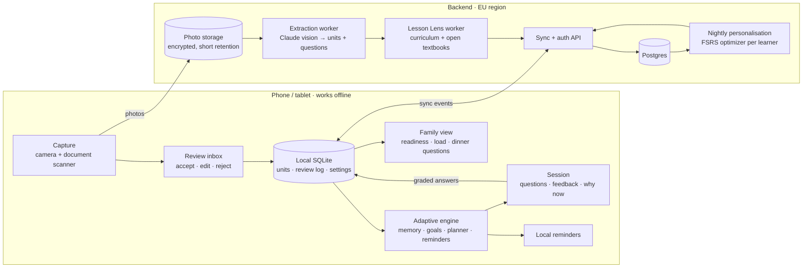
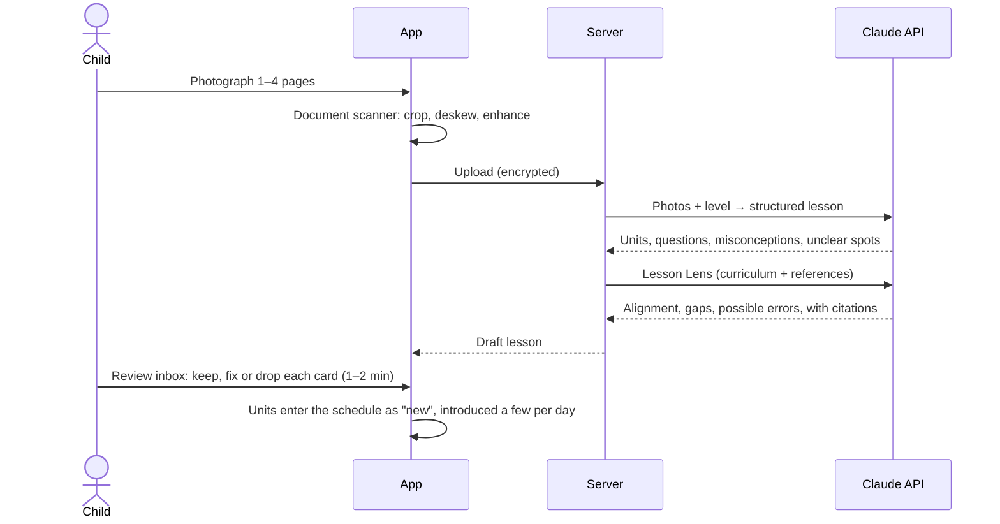
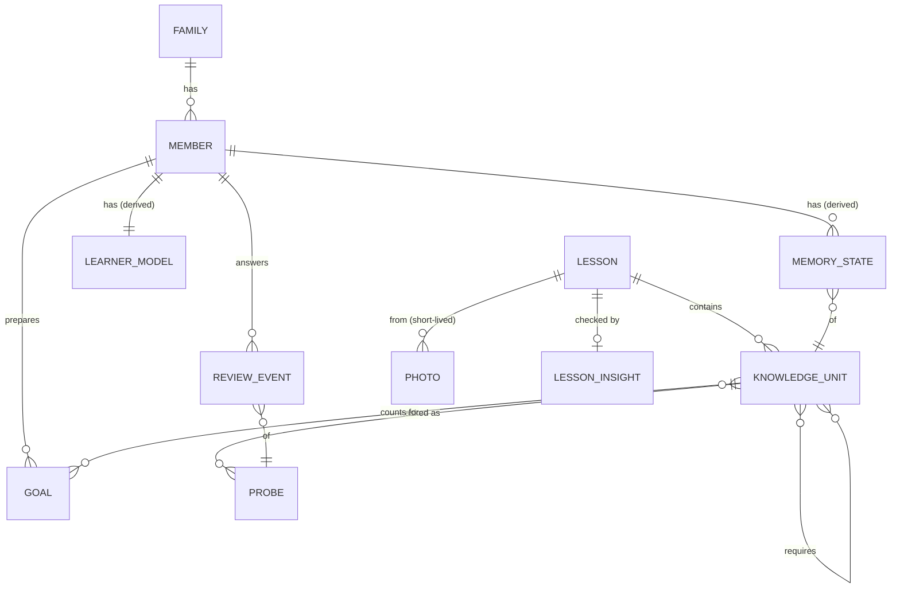

# Architecture proposal

Status: **v0 proposal, open for discussion** (2 October 2026).
Companion documents: [Adaptive engine](ADAPTIVE_ENGINE.md) · [Calm-by-design charter](CHARTER.md) · [clickable prototype](../prototype/index.html)

---

## 1. What we are building

This is a learning companion for the whole family, on phone and tablet. You photograph a lesson and the app turns it into small units of knowledge, each with its own questions. Each family member then reviews in short sessions that end, scheduled around their own memory and their upcoming tests. Every lesson can also be checked against the official curriculum and open textbooks.

It is built as the opposite of an engagement product. **Success means knowledge kept per minute spent.** The app's reminders are designed to make themselves unnecessary over time.

The README's four use cases map to four subsystems:

| README use case | Subsystem | Section |
|---|---|---|
| 1. Take pictures of lessons | Capture and extraction pipeline | [4.1](#41-capture--cards) |
| 2. Review schedules à la Anki/Duolingo | Adaptive engine (memory, goals, sessions, reminders) | [4.2](#42-the-daily-session), [5](#5-the-adaptive-engine-in-one-page) |
| 3. Learning curve of every concept ("everything is a language") | Knowledge model and mastery map | [4.3](#43-learning-curves-and-the-concept-map) |
| 4. Compare lessons with reference textbooks and papers | Lesson Lens | [4.4](#44-lesson-lens-comparing-with-reference-material) |

## 2. Principles

1. **Learning science over engagement metrics.** The app uses retrieval practice, spacing, interleaving, immediate feedback and desirable difficulty, which have the strongest evidence of the techniques studied ([Dunlosky et al., 2013](#references)).
2. **Finite by design.** Each session is computed to fit a time budget the family agreed on, and then it ends. There is no feed and no "one more lesson" button.
3. **Adapted to each person.** Each learner has their own memory model, retention targets follow goals and test dates, and reminders are tuned to each child.
4. **Autonomy, competence and relatedness** ([Self-Determination Theory](#references)) replace streaks, gems and leagues.
5. **Explainable.** Every card can say why it is shown today, and parents and children see the same information.
6. **Local-first and private.** The schedule runs on the device and works offline. Children's data is kept minimal and hosted in the EU.
7. **The teacher's version comes first.** Reference material adds to the lesson; it never overwrites what the child will be tested on.

The full rule set, including which rules are enforced by tests, is in the [charter](CHARTER.md).

## 3. System overview



Where each part runs, and why:

| Runs on the device | Runs on the server |
|---|---|
| Scheduling, session planning, grading of short answers, reminders: these must work offline, respond instantly and keep answer data local. | Claude calls (the API key never ships in the app), the FSRS optimizer, sync and backups. |

The engine is one TypeScript package ([`packages/engine`](../packages/engine)) that runs unchanged on the phone and on the server.

## 4. Main flows

### 4.1 Capture → cards



* **Scanner on the device:** ML Kit Document Scanner on Android, VisionKit on iOS. Better photos mean better extraction, and the scanner adds no upload cost.
* **Extraction:** one Claude call with vision and structured output. The schema and prompt are in [`packages/ingest`](../packages/ingest) and an example output is in [`fixtures/fractions-5e.json`](../packages/ingest/fixtures/fractions-5e.json). The call:
  * splits the lesson into units, one idea each: a word, a rule, a date, a method;
  * keeps the teacher's wording;
  * writes questions at several levels, with fresh numbers for maths methods;
  * lists common misconceptions, which become wrong answer choices and extra checks;
  * marks anything it couldn't read as `uncertain` instead of guessing.
* **Review inbox:** nothing reaches the schedule without a person accepting it. Ideally the child does it: choosing and fixing your own cards is itself learning (the generation effect), and it catches extraction mistakes.
* **Gradual introduction:** a lesson of 15 units is not dumped on the child the same evening. The planner introduces new units only when the reviews already due fit the budget, prerequisites first, and material for the nearest test first.
* **Rough cost:** a photographed page is about 2k input tokens plus a few thousand output and thinking tokens, so roughly 10–20 US cents per page with `claude-opus-5-5`. For two children photographing about one page a day each, that is roughly $10–20 a month. Lessons that can wait an hour can go through the Batch API at half price. Switching extraction to a cheaper model is possible, but it is a decision to make after measuring quality on your own photos.

### 4.2 The daily session

```mermaid
sequenceDiagram
  participant Engine
  participant Child
  Engine->>Engine: planSession(budget, due units, tests, new units)
  Engine->>Child: Reminder in an agreed time slot (max 1/day, informational)
  Child->>Engine: Start (or starts on their own)
  loop each question
    Engine->>Child: Question at the right level, with a "why now?" note
    Child->>Engine: Answer (+ optional sure/unsure tap)
    Engine->>Engine: Grade objectively → FSRS update → next due date
    Engine->>Child: Immediate feedback; missed cards return once at the end
  end
  Engine->>Child: Clear end screen: what became solid, test readiness
```

* **Budget:** 5–20 minutes a day, agreed by the child and a parent. The planner never exceeds it. Due cards that don't fit are pushed to another day without ever being shown to the child as a backlog.
* **Grading is objective:** correctness, hints used, and answer time compared with the child's own usual speed. Children are never asked to rate a card "Easy", because self-ratings drift toward whatever ends the session soonest.
* **Answer modes:** typing, multiple choice while a memory is still fragile, speaking (on-device speech recognition for young children and for languages), and maths entry checked for equivalence (1/2 = 0.5 = 2/4 when the question allows it).
* **Inside the session:** after three misses in a row the planner slips in an easier unit, and after five it ends the session kindly. Missed units come back once at the end of the session (successive relearning, [Rawson & Dunlosky, 2011](#references)). The child can stop at any time with no penalty.

### 4.3 Learning curves and the concept map

The README's "everything seen as a language" is the core data model. Every subject is broken into **knowledge units** of six kinds:

| Kind | Examples | Question ladder (easy → hard) |
|---|---|---|
| term | *photosynthèse*, *tener*, "numerator" | recognise → recall → use in a sentence |
| fact | 496: baptism of Clovis; capital of Peru | recognise → recall |
| rule | past participle agreement with *avoir*; sign rules | recognise → recall → apply to a new sentence |
| procedure | adding fractions; solving 2x + 3 = 7 | recognise → recall → fresh generated exercise |
| concept | why seasons change; what a food chain is | recognise → recall → apply → explain |
| formula | area of a disc; *v = d/t* | recognise → recall → apply |

* **The learning curve of each unit is its memory state:** stability (how many days until recall drops to 90%), difficulty, and today's predicted recall.
* **Mastery labels** for the family view:
  * *new*;
  * *learning*: stability under 3 days;
  * *fragile*: recall currently below its target;
  * *solid*: stability of 3 weeks or more;
  * *mastered*: stability of 3 months or more, with the top question level passed.
* **Prerequisite graph:** units link to the units they build on, taken from extraction and from the curriculum. A new unit waits until its prerequisites are known.
* **Units that keep failing are re-taught, not drilled:** if a unit lapses again and again, the app checks its prerequisites first ("fraction addition keeps failing; equivalent fractions are fragile"). It then offers a different explanation, a worked example, or a "teach-back" with a parent, and can split the unit in two. Anki suspends such cards; here they are re-taught.
* **Planned for later:** a knowledge-tracing layer over the graph ([BKT/DKT](#references)) to estimate mastery of skills that are never asked directly.

### 4.4 Lesson Lens: comparing with reference material

For each extracted lesson, a second step compares it with:

1. **The official curriculum for the child's level.** For French schools this is the *programmes* and *attendus de fin d'année* on Eduscol. The text for one level is small enough to send in full with each request and cache, which avoids running a search index.
2. **Open textbooks and encyclopedias** with compatible licences: Sésamath (CC BY-SA, French maths), OpenStax (CC BY), Wikipedia and Wikibooks.
3. **For adult or advanced topics:** papers via OpenAlex, Semantic Scholar or a research-search connector.

**Version 1** uses Claude's server-side web search restricted to an allowlist of these domains, with citations. **Version 2** indexes a curated corpus for reproducibility and offline use.

The output is a short **lesson insight**, shown to the parent first:

* ✔ Matches *Fractions: add when one denominator is a multiple of the other* (5e).
* ➕ A common confusion is adding the denominators (3/4 + 1/8 ≠ 4/12). One check card was added for it.
* ⚠ A possible inaccuracy, with its sources. It is shown to the parent only, never as "your teacher is wrong" to the child.
* ↗ Optional enrichment: an alternative explanation, a real-world example, and "going further" for a curious child.

Additions are marked as additions. Cards keep the teacher's version, because that is what the test will check.

### 4.5 The family layer

* **Roles:**
  * *Parent*: account owner, gives consent, sets limits together with the child.
  * *Child*: own profile, on their own device or a shared tablet with profile switching.
  * *Adult learner*: parents learn too, whether a language, a professional topic or a stack of papers. The same engine handles "any topic that needs refinement".
* **The family view shows information, not surveillance.** Children see what parents see about them. Parents see: readiness for upcoming tests, time used against the budget, a load forecast, and whether reminders are still needed.
* **Dinner-table questions:** three questions per child from what is due this week, for a parent to ask aloud. This is retrieval practice without a screen, and it gives the family something to talk about.
* **Teach-back:** "Ask Léa to explain why 3/4 = 6/8." Explaining something to someone is a strong way to learn it ([Fiorella & Mayer, 2013](#references)).
* **Shared units:** siblings or a parent learning the same Spanish list share the units, but each person has their own memory state for them.
* **Cooperative, never competitive:** a shared family goal, for example a garden that grows with everyone's sessions. There are no rankings and no strangers.
* **Weekly summary** for parents on Sunday evening, informational only.

## 5. The adaptive engine in one page

Adaptivity happens in five feedback loops, each on its own timescale. Details and formulas are in [ADAPTIVE_ENGINE.md](ADAPTIVE_ENGINE.md).

| Loop | Timescale | What adapts | How | Code |
|---|---|---|---|---|
| Memory | each answer | when each unit comes back | FSRS-6 memory model with weights fitted to each learner | `memory.ts`, `personalize.ts` |
| Goals | each day | how high to aim | retention target per unit (importance, test window, after-test maintenance); reviews pulled before test dates | `retention.ts`, `scheduler.ts` |
| Session | each answer, within a session | what comes next, when to stop | budget, interleaving, easy opener and closer, ease-off after misses, one retry | `planner.ts`, `session.ts` |
| Reminders | each day | whether and when to remind | Thompson sampling over agreed time slots; back-off when ignored; pause once the child starts on their own | `nudge.ts` |
| Workload | each week | how much new material, how high to aim | new units throttled by recent accuracy; retention targets relaxed under sustained overload | `planner.ts`, `retention.ts` |

The simulation compares three schedulers over 60 days (`npm run simulate`). It uses two synthetic learners, 432 units, a 10-minute budget and five tests:

| Learner | Scheduler | min/day | Recall on test days | Worst test | Recall of all units at day 60 |
|---|---|---|---|---|---|
| A: forgets fast | Fixed ladder (Leitner/Duolingo-style) | 8.2 | 48% | 24% | 56% |
| A: forgets fast | FSRS, population weights | 6.8 | 52% | 37% | 60% |
| A: forgets fast | **Adaptive** (personal + test-aware) | 7.8 | **89%** | **77%** | 59% |
| B: strong memory | Fixed ladder | 7.9 | 51% | 25% | 60% |
| B: strong memory | FSRS, population weights | 6.8 | 64% | 57% | 76% |
| B: strong memory | **Adaptive** | 7.1 | **93%** | **79%** | 73% |

In the same time, the adaptive engine makes children ready on test days without losing overall retention. The learners are synthetic, so these numbers show how the mechanics behave, not what real children will do. Caveats are in [ADAPTIVE_ENGINE.md §8](ADAPTIVE_ENGINE.md#8-simulation).

## 6. Data model



* **`REVIEW_EVENT` is append-only and is the source of truth.** It records the member, probe, time, answer, correctness, latency, hints, confidence, the grade and the engine version.
* **`MEMORY_STATE` (stability, difficulty, due date) and `LEARNER_MODEL` (FSRS weights, typical answer speed, reminder statistics) are caches.** They are rebuilt by replaying the log whenever the model changes, for example after the nightly fit. The simulation does exactly this.
* **Sync:** review events are immutable, so syncing them never conflicts. Editable records (units, settings, goals) use last-writer-wins with an edit history.
* **Units can be shared, memories are personal:** the same `KNOWLEDGE_UNIT` can belong to two siblings, with a separate `MEMORY_STATE` for each.

## 7. Technology choices

| Layer | Proposal | Why | Alternatives |
|---|---|---|---|
| App | **React Native + Expo (TypeScript)** | One codebase: Android first, then iPhone and tablet. The engine runs unchanged on the device. Camera, notifications and SQLite are covered by Expo modules. | Flutter (equally good; the engine would be ported to Dart, where FSRS ports exist); Kotlin Multiplatform |
| Local data | expo-sqlite + Drizzle | Works offline, typed queries | WatermelonDB |
| Sync | Custom event sync, or PowerSync / ElectricSQL over Postgres | Append-only events make sync simple | Firebase (less suited to EU data residency and relational data) |
| Backend | **Supabase in an EU region** (Postgres, Auth, Storage, Edge Functions) | Little to operate for a family-sized project | A small Node service (Hono) + Postgres, self-hosted |
| Memory model | **FSRS-6** via `ts-fsrs` on the device; optimizer `fsrs-rs` via `@open-spaced-repetition/binding` on the server | State of the art among open schedulers, actively maintained, and per-user fitting takes about a second | SM-2 (Anki's legacy scheduler), HLR (Duolingo), [benchmarked here](https://github.com/open-spaced-repetition/srs-benchmark) |
| AI | **Claude API** (`claude-opus-5-5`): vision + structured outputs for extraction; web search with a domain allowlist + citations for Lesson Lens; rubric grading of free-text answers | One provider for vision, structured data and cited search | — |
| Speech | On-device speech recognition and text-to-speech | Private, works offline, free | Cloud speech-to-text |
| Maths | KaTeX for display; mathjs (device) or SymPy (server) for checking answers | Equivalent answers count as correct | — |
| Reminders | Local notifications scheduled by the engine | No push server, no tracking, work offline | — |

## 8. Privacy, safety, compliance

* **Children's data under GDPR.** In France, parental consent is required under 15. The parent owns the account. Child profiles hold a first name or nickname, a school level and a birth year, and nothing more.
* **Photos are deleted after extraction by default;** the extracted text is kept. Data is hosted in the EU and encrypted at rest. There are no ads, no third-party analytics or tracking SDKs, and a full export or delete takes one tap.
* **AI calls go only through the server.** Under Anthropic's commercial terms, API inputs are not used for model training by default. Check the account's current data-retention settings before launch. The extraction prompt ignores names, and the review inbox shows parents anything personal it finds.
* **No open-ended chatbot for children in v1.** All generated content goes through the review inbox.
* **External reference points:** the UK ICO *Age Appropriate Design Code* (its standard on nudge techniques) and the CNIL's recommendations on minors online. The [charter](CHARTER.md) goes further than both.

## 9. What we measure, and what we refuse to optimise

**Optimised:**
* Recall on test days, and recall at 30 and 60 days, per minute spent (knowledge kept per minute).
* Prediction quality of the memory model (log loss, calibration).
* Share of sessions the child starts on their own (autonomy and habit).
* Time used staying within budget.
* Sessions ended by "ease-off". These should be rare; if they exceed about 10% for a child, the parent is told and re-teaching is suggested.
* Optionally, a one-tap mood check at the end of a session.

**Never optimised, and only shown if they cross a guardrail:** time in app, sessions per day, notification open rate, streak length.

## 10. Roadmap

| Phase | Scope | Done when |
|---|---|---|
| **0 (this branch)** | Engine core + simulation, extraction sample, clickable prototype, this proposal | The family has tried the prototype and answered the [open questions](#11-open-questions) |
| **1. One family, end to end** | Expo app on Android. Photo → review inbox → cards. Daily session with FSRS and a budget. Local reminders. Simple parent view. | The children use it for 3 weeks on two subjects |
| **2. Adaptive** | Test dates, nightly per-learner fitting, question ladder, learned reminder slots, workload control, "why now?" | Calibration and test-day recall are measured on the family's real data |
| **3. Lesson Lens + concept map** | Curriculum alignment, misconceptions → extra questions, prerequisite graph, re-teaching units that keep failing | Parents find the lesson insight useful on ≥ 2 of 3 lessons |
| **4. Family** | Dinner questions, teach-back, adult learners, shared units, weekly summary, iPhone and tablet layouts | Every family member has used it for a month |
| **5. Optional** | Import homework and test dates from the school platform (Pronote / ÉcoleDirecte); opening to other families | — |

## 11. Open questions

These change the design, so they come first:

1. **Ages, school levels and school system** of the children (France? which grades?). This drives reading level, answer modes (voice for young children), curriculum mapping and consent rules.
2. **Who builds it and with what?** If you prefer another language (Kotlin, Dart, Python), the stack changes.
3. **Is cloud AI acceptable for lesson photos** (Claude API, EU-hosted backend, photos deleted after extraction), and what monthly budget is acceptable?
4. **Family-only tool or a product for other families** (open source? hosted?). This changes accounts, compliance and hosting.
5. **Devices:** does each child have a phone, or is there a shared family tablet? With a shared tablet, reminders go to a parent or to the household, not to a child.
6. **School platform:** Pronote, ÉcoleDirecte or another ENT? Importing test dates automatically is the biggest boost to the adaptive engine.
7. **What will the adults learn**, and should adult profiles be able to import Anki decks or papers?
8. **UI language:** French only, or bilingual from day one?

Name ideas to try on the children: *Ardoise* (the school slate), *Rappel*, *Mémo*, *Boussole*, *Lierre*.

## References

* Bjork, E. L. & Bjork, R. A. (2011). Making things hard on yourself, but in a good way: creating desirable difficulties to enhance learning.
* Butterfield, B. & Metcalfe, J. (2001). Errors committed with high confidence are hypercorrected. *JEP: Learning, Memory, and Cognition*.
* Cepeda, N. J. et al. (2006). Distributed practice in verbal recall tasks: a review and quantitative synthesis. *Psychological Bulletin*.
* Cepeda, N. J. et al. (2008). Spacing effects in learning: a temporal ridgeline of optimal retention. *Psychological Science*.
* Corbett, A. T. & Anderson, J. R. (1994). Knowledge tracing: modeling the acquisition of procedural knowledge. *User Modeling and User-Adapted Interaction*.
* Deci, E. L., Koestner, R. & Ryan, R. M. (1999). A meta-analytic review of experiments examining the effects of extrinsic rewards on intrinsic motivation. *Psychological Bulletin*.
* Dunlosky, J. et al. (2013). Improving students' learning with effective learning techniques. *Psychological Science in the Public Interest*.
* Fiorella, L. & Mayer, R. E. (2013). The relative benefits of learning by teaching and teaching expectancy. *Contemporary Educational Psychology*.
* Gollwitzer, P. M. (1999). Implementation intentions: strong effects of simple plans. *American Psychologist*.
* Lally, P. et al. (2010). How are habits formed: modelling habit formation in the real world. *European Journal of Social Psychology*.
* Piech, C. et al. (2015). Deep knowledge tracing. *NeurIPS*.
* Rawson, K. A. & Dunlosky, J. (2011). Optimizing schedules of retrieval practice for durable and efficient learning: how much is enough? *JEP: General*.
* Roediger, H. L. & Karpicke, J. D. (2006). Test-enhanced learning: taking memory tests improves long-term retention. *Psychological Science*.
* Rohrer, D. & Taylor, K. (2007). The shuffling of mathematics problems improves learning. *Instructional Science*.
* Ryan, R. M. & Deci, E. L. (2000). Self-determination theory and the facilitation of intrinsic motivation, social development, and well-being. *American Psychologist*.
* Settles, B. & Meeder, B. (2016). A trainable spaced repetition model for language learning (Duolingo's half-life regression). *ACL*.
* Tabibian, B. et al. (2019). Enhancing human learning via spaced repetition optimization. *PNAS*.
* Wilson, R. C. et al. (2019). The eighty five percent rule for optimal learning. *Nature Communications*.
* Ye, J., Su, J. & Cao, Y. (2022). A stochastic shortest path algorithm for optimizing spaced repetition scheduling. *KDD*. (Origin of FSRS.)
* Open Spaced Repetition: [FSRS algorithm](https://github.com/open-spaced-repetition/fsrs4anki/wiki/The-Algorithm), [srs-benchmark](https://github.com/open-spaced-repetition/srs-benchmark).
* UK Information Commissioner's Office (2020). *Age appropriate design: a code of practice for online services*.
